## [LBNL]{.kicker} Laser-Induced Breakdown Spectroscopy {.hero .center background-color="#0b2545" background-gradient="radial-gradient(circle at 85% 10%, #1d4677 0%, #0b2545 48%, #071a33 100%)"}

::: hero-sub
A research overview: resonant excitation, high-pressure brines, and soils
:::



::: hero-author
Christian L. Goueguel, PhD
:::

::: hero-meta

:::

::: notes
- Thank the hosts. Over the next ~40 minutes: a short introduction to who I am, then three LIBS research threads.
- The emission lines above are real line positions for the elements that appear in this talk (Ca, Al, Pb, Sr, Ba, Mg, Na, Li, K).
:::

<!-- =====================================================================
     ABOUT ME (LIBS work only)
     ===================================================================== -->

## [About me]{.kicker} My LIBS work, from fundamentals to deployable instruments

```{=html}
<div class="career">
  <div class="career-row simple fragment fade-up">
    <div class="what">Wavelength-selective LIBS (RELIBS, LA-LIF, RLA-LIF) for trace analysis in metal alloys</div>
    <div class="thread"><span class="tag accent">Part 1</span></div>
  </div>
  <div class="career-row simple fragment fade-up">
    <div class="what">LIBS of high-pressure CO<sub>2</sub>–water systems for monitoring geologic carbon storage</div>
    <div class="thread"><span class="tag accent">Part 2</span></div>
  </div>
  <div class="career-row simple fragment fade-up">
    <div class="what">Rugged, fiber-coupled underwater LIBS sensor for high-pressure, high-salinity groundwater</div>
    <div class="thread"><span class="tag accent">Part 2</span></div>
  </div>
  <div class="career-row simple fragment fade-up">
    <div class="what">Benchtop LIBS analyzer for soils and plant tissues; chemometric / ML calibration; soil texture and soil carbon</div>
    <div class="thread"><span class="tag accent">Part 3</span></div>
  </div>
</div>
```

::: notes
- Fundamentals: how to make LIBS more sensitive by tuning the laser to atomic transitions. This is Part 1.
- Carbon-storage monitoring: took LIBS into liquids at high CO₂ pressure, then into a rugged fiber-coupled sensor. This is Part 2.
- Industrial R&D: a benchtop LIBS analyzer for agriculture, with chemometrics / ML. Part 3 (soil texture).
:::

## [About me]{.kicker} LIBS track record at a glance

```{=html}
<div class="stats cols-4">
  <div class="stat"><div class="stat-value"><span class="countup" data-to="20">20</span>+</div>
    <div class="stat-label">peer-reviewed LIBS papers &amp; proceedings</div></div>
  <div class="stat accent"><div class="stat-value"><span class="countup" data-to="3">3</span></div>
    <div class="stat-label">journal cover articles</div><div class="stat-note">J. Anal. At. Spectrom.</div></div>
  <div class="stat"><div class="stat-value"><span class="countup" data-to="2">2</span></div>
    <div class="stat-label">book chapters on LIBS</div><div class="stat-note">Elsevier · Nova Science</div></div>
  <!-- <div class="stat"><div class="stat-value">1<small>st</small></div> -->
  <!--   <div class="stat-label">prize, LIBS Student Poster Award</div><div class="stat-note">for resonance-enhanced LIBS</div></div> -->
</div>
```

::: {.fragment .fade-up style="margin-top:1.4em"}
[Core expertise]{.kicker}

[ns &amp; fs laser ablation]{.tag} [Tunable OPO excitation]{.tag} [LIF &amp; resonance-enhanced LIBS]{.tag} [Underwater &amp; high-pressure LIBS]{.tag} [Fiber-coupled sensor design]{.tag} [Instrument prototyping &amp; validation]{.tag} [Chemometrics &amp; ML (R, Python, MATLAB)]{.tag} [Optical design (Zemax)]{.tag}

[Reviewer for *J. Anal. At. Spectrom.*, *Opt. Lett.*, *Opt. Express*, *Appl. Opt.*, *Photonics Research*, *ChemComm*]{.small .muted}
:::

::: notes
- Three cover articles in JAAS: RELIBS (inside front cover), CaCO₃ dissolution under CO₂ pressure by underwater LIBS (front cover), soil texture by LIBS (back cover).
- Book chapters: LIBS applied to liquids (Elsevier) and LIBS for carbon sequestration R&D (Nova Science).
:::

## [Roadmap]{.kicker} Three questions, one technique

[LIBS is fast, multi-element, and needs little or no sample preparation. My work has pushed it on three fronts:]{.lead}

```{=html}
<div class="card-grid cols-3" style="margin-top:.9em">
  <div class="card fragment fade-up">
    <div class="num">01 · SENSITIVITY</div>
    <h3>Wavelength-selective excitation</h3>
    <p>Can tuning the laser to an atomic transition boost sensitivity while sparing the sample?</p>
  </div>
  <div class="card fragment fade-up">
    <div class="num">02 · HARSH ENVIRONMENTS</div>
    <h3>Groundwater monitoring</h3>
    <p>Can LIBS quantify dissolved metals in CO<sub>2</sub>-saturated brine at up to 400&nbsp;bar?</p>
  </div>
  <div class="card fragment fade-up">
    <div class="num">03 · COMPLEX MATRICES</div>
    <h3>Soil texture</h3>
    <p>Can LIBS spectra, decoded by chemometrics, predict sand, silt and clay fractions directly?</p>
  </div>
</div>
```

::: notes
- Frame the talk as three limits of conventional LIBS: sensitivity, environment, and matrix complexity.
- Each part follows the same arc: question → approach → key result.
:::

<!-- =====================================================================
     PART 1 · WAVELENGTH-SELECTIVE EXCITATION
     ===================================================================== -->

# [Part 01]{.sec-num} Wavelength-Selective Excitation {.section-divider .center background-color="#0b2545"}

::: sec-big
01
:::

::: sec-rule
:::

::: sec-question
Can tuning the laser to an atomic transition boost sensitivity — while sparing the sample?
:::

## [Part 1 · Selective excitation]{.kicker} The idea: tune the laser to an atomic transition

:::: {.columns}
::: {.column width="56%"}
**Conventional LIBS**: a single laser pulse ablates, atomizes and excites the sample all at once. More signal usually means more fluence, and with it more continuum and more damage.

::: fragment
**Wavelength-selective LIBS**: a *wavelength-tunable* laser (OPO) is tuned to a specific transition of the **analyte** or of the **matrix**, so the vapor is excited selectively and efficiently.
:::
:::

::: {.column width="40%"}
::: {.fragment .takeaway}
**Goal**: higher sensitivity and accuracy for **trace elements**, with minimal sample damage.
:::

::: {.fragment style="margin-top:1em"}
[Two case studies]{.kicker}

- **RELIBS**: Mg and Si in aluminium alloys
- **RLA-LIF & LA-LIF**: Pb traces in copper alloys
:::
:::
::::

::: notes
- In conventional LIBS, the same photons ablate and excite — so we cannot optimize the two steps independently.
- With a tunable laser we can address one atomic transition: that brings selectivity and, potentially, sensitivity at lower fluence.
:::

## [Part 1 · Selective excitation]{.kicker} Double-pulse ablation–excitation

::: panel-tabset
### Concept

:::: {.columns}
::: {.column width="62%"}
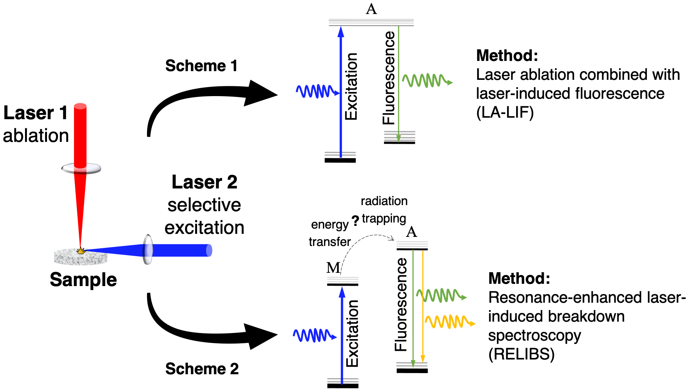{width="100%"}
:::
::: {.column width="36%" .side}
- **Pulse 1** (Nd:YAG, 1064 nm) creates a low-density vapor.
- **Pulse 2** (tunable OPO) is tuned to a resonant transition of:
  - the **analyte** → Scheme 1, **LA-LIF**
  - a **matrix element** → Scheme 2, **RELIBS**
:::
::::

### Experimental setup

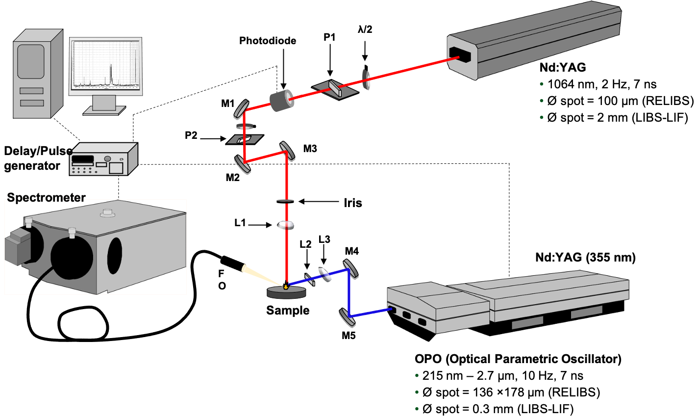

[Ablation: Nd:YAG 1064 nm, 7 ns · Excitation: OPO pumped at 355 nm, 215 nm – 2.7 µm, 10 Hz, 7 ns · delay/pulse generator and spectrometer]{.caption}
:::

::: notes
- Decoupling ablation and excitation lets us optimize each independently: ablation fluence, excitation wavelength, excitation fluence, and inter-pulse delay.
- Scheme 1 excites the analyte itself (laser-induced fluorescence); Scheme 2 excites the matrix and relies on energy redistribution in the plume.
:::

## [Part 1 · Selective excitation]{.kicker} Single-pulse resonant ablation

::: panel-tabset
### Concept

:::: {.columns}
::: {.column width="62%"}
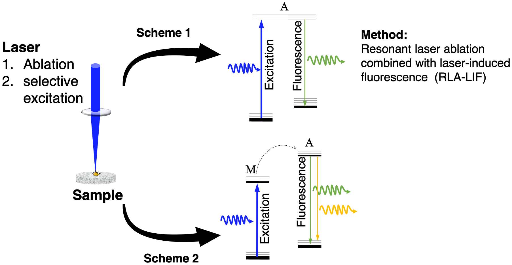{width="100%"}
:::
::: {.column width="36%" .side}
- **One tunable pulse** ablates the sample, and its remaining energy **resonantly excites** the vapor.
- Target the analyte → Scheme 1, **RLA-LIF**
- **One laser**: a simpler, lower-cost implementation.
:::
::::

### Experimental setup

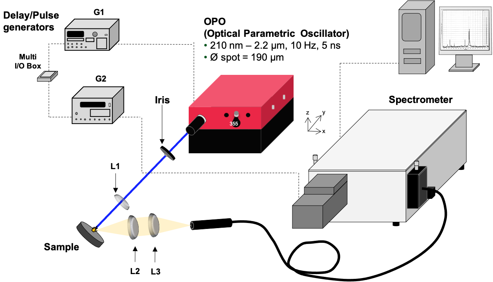

[OPO: 210 nm – 2.2 µm, 10 Hz, 5 ns, Ø spot ≈ 190 µm · two delay/pulse generators and spectrometer]{.caption}
:::

::: notes
- Same physics, one laser: the leading edge of the pulse ablates and the rest of the pulse, still on resonance, excites the vapor.
- Practical advantage: no second laser, no inter-pulse synchronization.
:::

## [Part 1 · Selective excitation]{.kicker} Three implementations, two case studies

```{=html}
<div class="method-map" style="margin-top:.6em">
  <div></div>
  <div class="hdr">Excite the analyte</div>
  <div class="hdr">Excite the matrix</div>

  <div class="rowh">Double pulse<small>ablation + tunable excitation</small></div>
  <div class="cell on anim-rise" style="--d:.15s"><b>LA-LIF</b><span>Pb traces in copper alloys</span></div>
  <div class="cell on anim-rise" style="--d:.3s"><b>RELIBS</b><span>Mg and Si in aluminium alloys</span></div>

  <div class="rowh">Single tunable pulse<small>ablation = excitation</small></div>
  <div class="cell on anim-rise" style="--d:.45s"><b>RLA-LIF</b><span>Pb traces in copper alloys</span></div>
  <div class="cell off anim-rise" style="--d:.6s">not covered today</div>
</div>
```

::: {.takeaway style="margin-top:1.2em"}
Same question throughout: **how much signal per unit of ablated material**, and at what cost in sample damage?
:::

::: notes
- This map is the roadmap for Part 1: first RELIBS (matrix excitation), then the two lead studies (analyte excitation), with one or two lasers.
:::

## [Part 1a · RELIBS]{.kicker} Resonance-enhanced LIBS: excite the matrix, read the analytes

:::: {.columns}
::: {.column width="46%"}
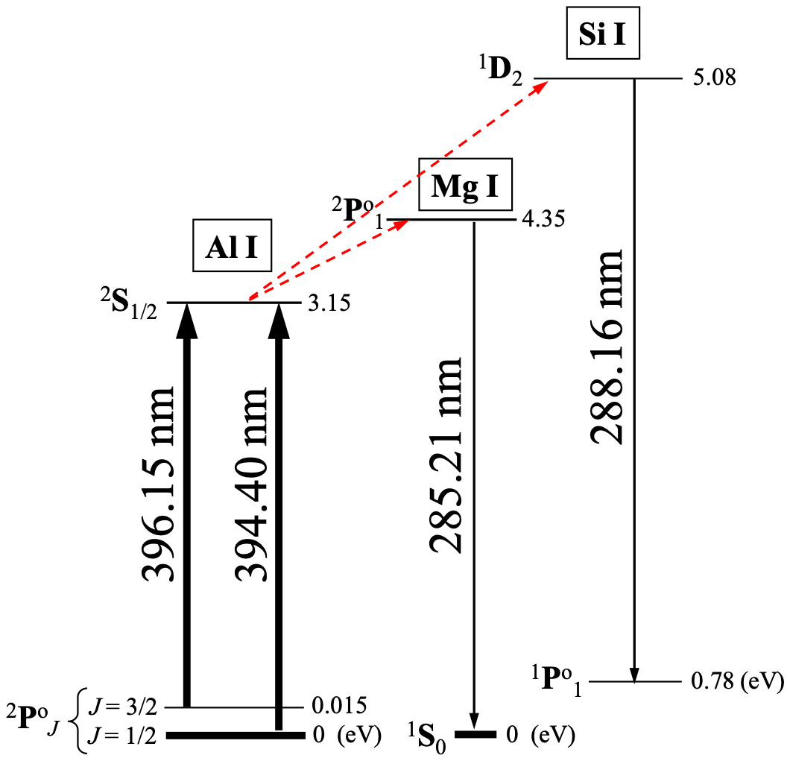{height="500px"}
:::
::: {.column width="52%"}
- The OPO is tuned to the **Al I resonance lines 394.40 / 396.15 nm**, so the aluminium matrix absorbs strongly.

::: fragment
- The absorbed energy is redistributed in the vapor plume (energy transfer, radiation trapping) and excites the analytes.
:::

::: fragment
- Detection of **Mg I 285.21 nm** and **Si I 288.16 nm**, far from the excitation wavelength.
:::
:::
::::

::: notes
- Exciting the matrix rather than each analyte makes RELIBS multi-elemental: one excitation wavelength, many analytes.
- The red dashed arrows indicate energy redistribution from excited Al atoms to Mg and Si levels.
:::

## [Part 1a · RELIBS]{.kicker} The enhancement is truly resonant

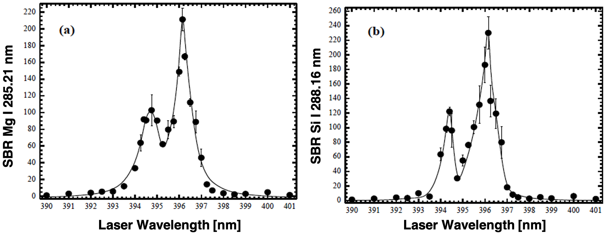{.fh-420}

::: {.takeaway .fragment}
Mg I 285.21 nm (a) and Si I 288.16 nm (b) emission peaks **only** when the OPO matches the Al I lines at **394.40** and **396.15 nm**.
:::

::: notes
- Scanning the excitation wavelength while monitoring the analyte lines gives an excitation spectrum: the two peaks are exactly the Al I resonance lines.
- So the effect is wavelength-selective — not simply a double-pulse reheating effect.
:::

## [Part 1a · RELIBS]{.kicker} Optimizing delay and fluences

::: panel-tabset
### Inter-pulse delay

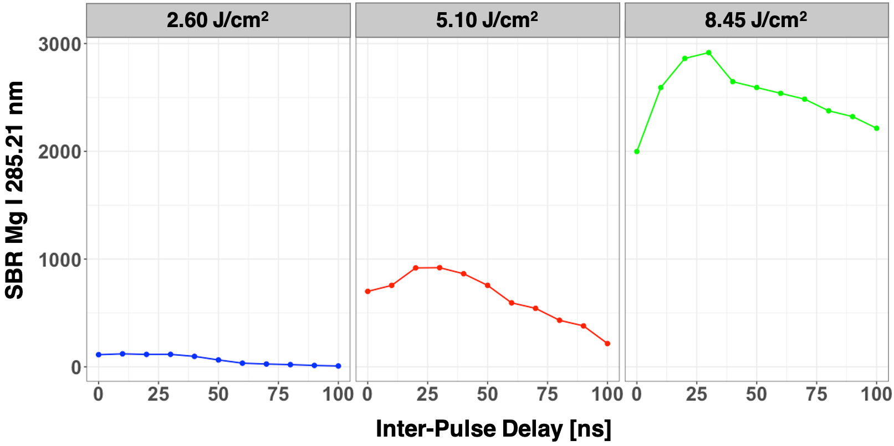

[Mg signal-to-background ratio grows with ablation fluence (2.60 → 8.45 J/cm²) and peaks ≈ 25 ns after the ablation pulse.]{.caption}

### Ablation & excitation fluences

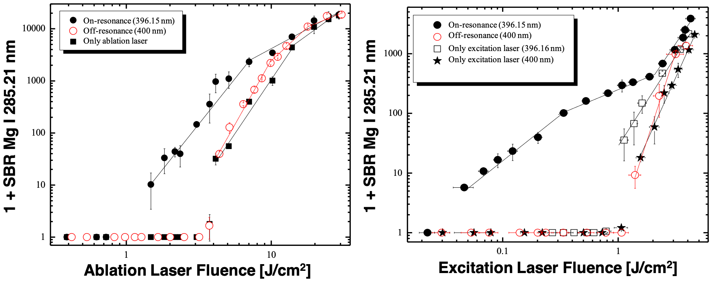

[On resonance (396.15 nm), Mg emission appears from ≈ 1.5 J/cm² ablation fluence, where the ablation pulse alone gives none (≈ 4 J/cm² needed), and from excitation fluences as low as ≈ 0.05 J/cm².]{.caption}
:::

::: notes
- Delay: the excitation pulse must arrive while the vapor is dense enough yet the plasma continuum has decayed (~25 ns here).
- Fluence: the resonant pulse lets us work below the normal LIBS threshold. Off-resonance (400 nm) or single-laser controls need much higher fluence.
:::

## [Part 1a · RELIBS]{.kicker} Calibration in aluminium alloys

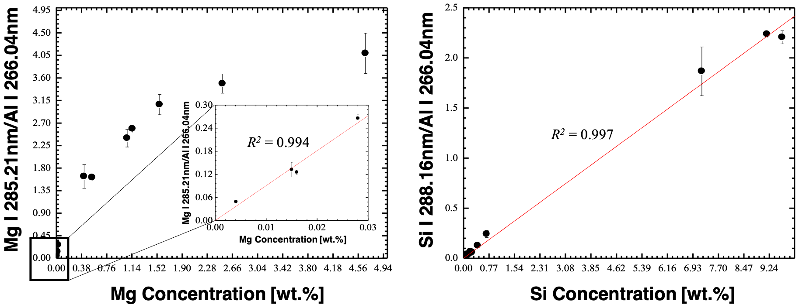{.fh-330}

:::: {.columns}
::: {.column width="48%"}
```{=html}
<table class="data">
  <thead><tr><th>Relative DL</th><th>RELIBS</th><th>LIBS (25.5 J/cm²)</th></tr></thead>
  <tbody>
    <tr><td>Mg</td><td>20 ppm</td><td>6 ppm</td></tr>
    <tr><td>Si</td><td>0.14 wt%</td><td>190 ppm</td></tr>
  </tbody>
</table>
```
:::
::: {.column width="50%" .small}
- Linear calibrations, internal standard Al I 266.04 nm: R² = 0.994 (Mg), 0.997 (Si).
- Relative DLs are **higher** than conventional LIBS…
- …but RELIBS samples far less material per shot. **Next: absolute DLs.**
:::
::::

::: notes
- Be upfront: in relative (ppm) terms RELIBS does not beat high-fluence LIBS.
- The fair comparison accounts for how much mass is ablated — that's the next two slides.
:::

## [Part 1a · RELIBS]{.kicker} Minimal sample damage

::: panel-tabset
### Confocal microscopy

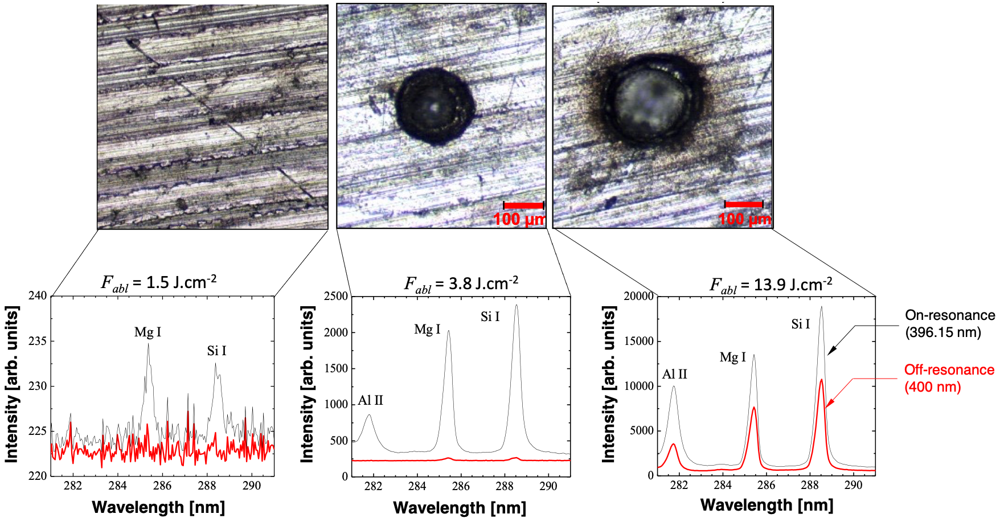

[At 1.5 J/cm² the Mg I and Si I lines appear only on resonance (396.15 nm, black) with no visible crater; at 3.8 and 13.9 J/cm² craters grow and off-resonance emission (400 nm, red) appears.]{.caption}

### Ablation rate

:::: {.columns}
::: {.column width="55%"}
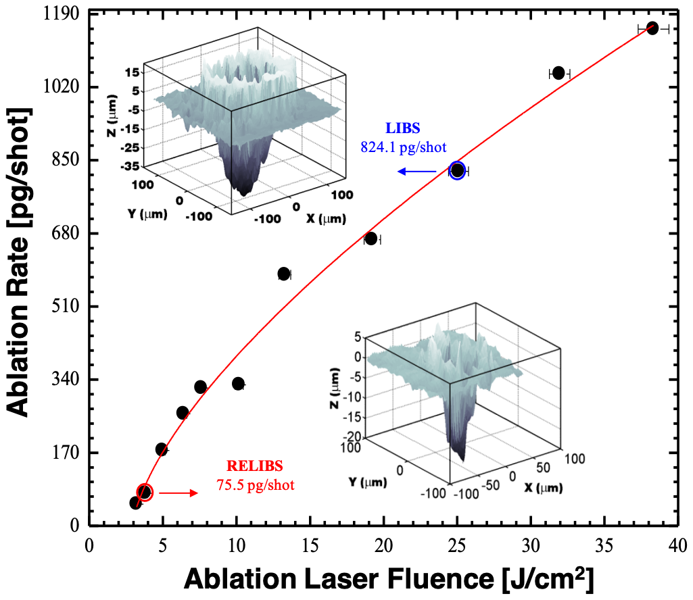{height="440px"}
:::
::: {.column width="43%"}
::: {.takeaway style="margin-top:3em"}
RELIBS ablated **≈ 10× less material** per shot:

**75.5 pg/shot** (RELIBS) vs **824.1 pg/shot** (LIBS)
:::
:::
::::
:::

::: notes
- Confocal images: near-invisible damage at the lowest fluence where RELIBS still yields analyte emission.
- Ablation rate from crater volumes (3D profiles in the insets).
:::

## [Part 1a · RELIBS]{.kicker} More signal per femtogram, far less damage

```{=html}
<div class="stats" style="margin-top:.6em">
  <div class="stat accent"><div class="stat-value"><span class="countup" data-to="0.7" data-decimals="1">0.7</span><small>fg</small></div>
    <div class="stat-label">absolute DL for <b>Mg</b></div><div class="stat-note">LIBS: 4 fg → ≈ 5× improvement</div></div>
  <div class="stat accent"><div class="stat-value"><span class="countup" data-to="50">50</span><small>fg</small></div>
    <div class="stat-label">absolute DL for <b>Si</b></div><div class="stat-note">LIBS: 128 fg → ≈ 3× improvement</div></div>
  <div class="stat"><div class="stat-value"><span class="countup" data-to="75.5" data-decimals="1">75.5</span><small>pg/shot</small></div>
    <div class="stat-label">ablated mass with RELIBS</div><div class="stat-note">LIBS: 824.1 pg/shot → ≈ 10× less material</div></div>
</div>
```

::: {.takeaway .fragment style="margin-top:1.6em"}
RELIBS is the method of choice when **surface damage must be minimal**: it improves *absolute* sensitivity while removing an order of magnitude less material. (LIBS reference at 25.5 J/cm².)
:::

::: notes
- Absolute DL = mass of analyte detectable per shot. RELIBS wins here: ~5× for Mg, ~3× for Si.
- Use cases: precious or thin samples, surface layers, depth-resolved analysis.
:::

## [Part 1b · RLA-LIF & LA-LIF]{.kicker} Lead: excite at 283.31 nm, detect at 405.78 nm

:::: {.columns}
::: {.column width="46%"}
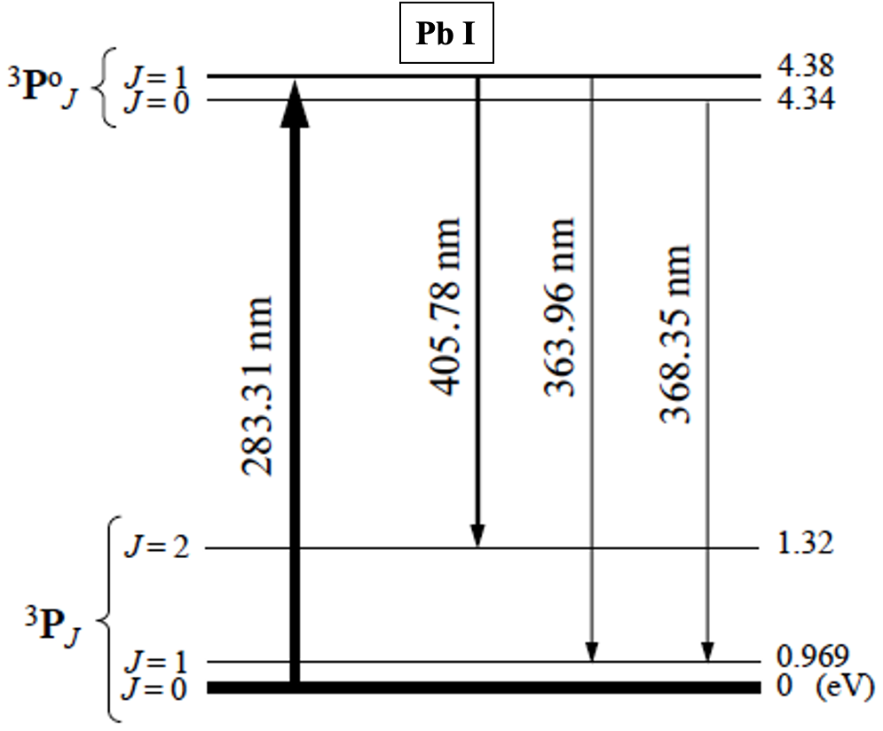{height="470px"}
:::
::: {.column width="52%"}
- **Excitation 283.31 nm**: Pb I ground state ³P₀ → ³P°₁ (4.38 eV).

::: fragment
- **Fluorescence 405.78 nm** to the ³P₂ level (1.32 eV): *Stokes direct-line* fluorescence, > 120 nm from the laser line, so scattered laser light is easy to reject.
:::

::: fragment
- Additional decay channels at 363.96 and 368.35 nm.
:::
:::
::::

::: notes
- Here we excite the analyte itself. Detecting at a different wavelength than the excitation is the key to a low background.
- Samples: copper alloys (brass) with Pb in the ppm range.
:::

## [Part 1b · RLA-LIF]{.kicker} One tunable pulse does both: ablation and excitation

::: panel-tabset
### Spectral selectivity

:::: {.columns}
::: {.column width="60%"}
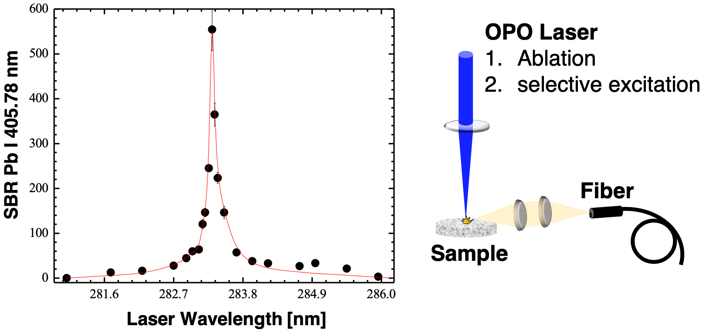{width="100%"}
:::
::: {.column width="38%" .side}
- The Pb I 405.78 nm SBR peaks sharply when the single OPO pulse is tuned to **283.3 nm**.
- Off resonance, the same pulse yields little Pb signal.
:::
::::

### Gate delay

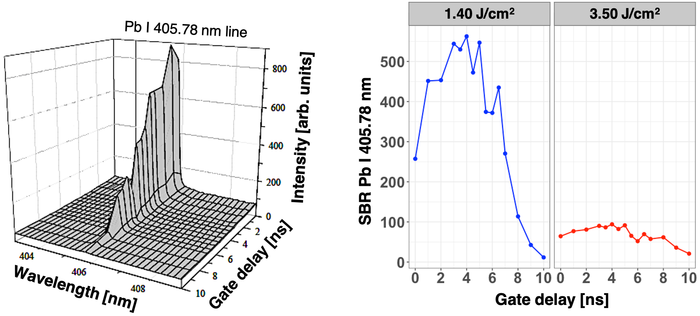

[Fluorescence is prompt: at 1.40 J/cm² the SBR peaks within the first few ns of the gate; at 3.50 J/cm² it is more than 5× lower.]{.caption}

### Laser fluence

:::: {.columns}
::: {.column width="50%"}
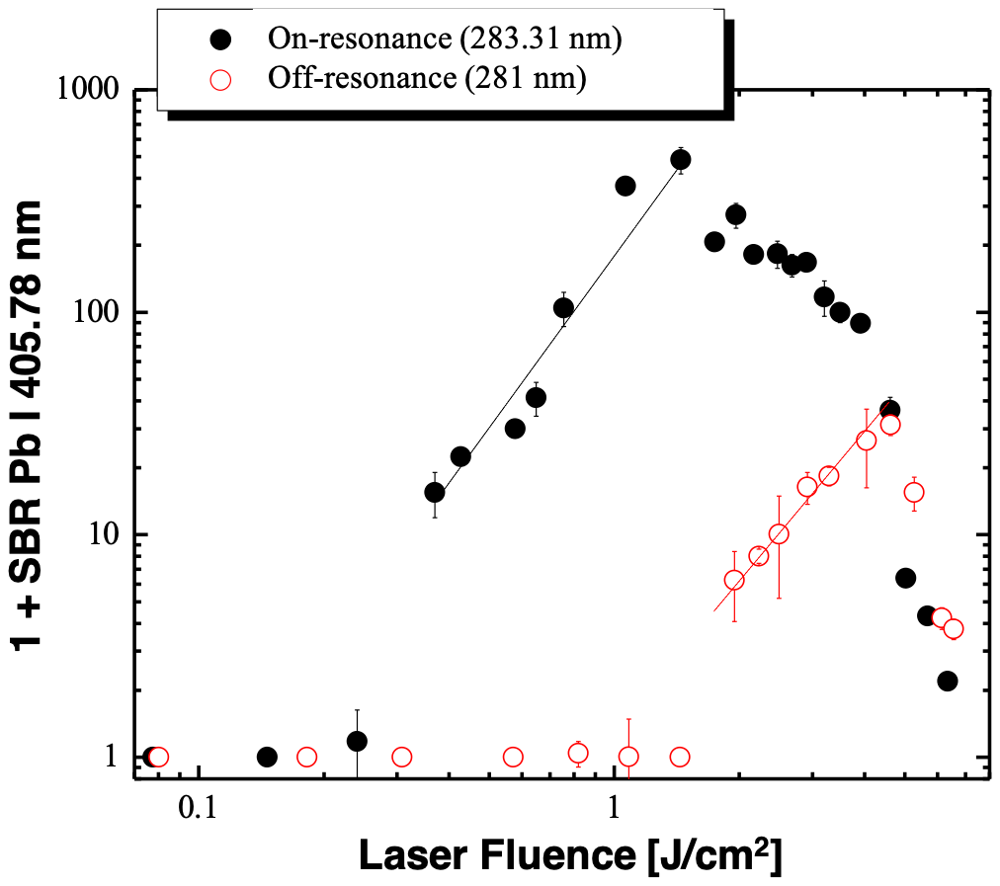{height="430px"}
:::
::: {.column width="48%" .side}
- **On resonance (283.31 nm)**: SBR rises steeply up to ≈ 1 J/cm², then falls at higher fluence.
- **Off resonance (281 nm)**: weak signal, only above ≈ 1 J/cm².
- → An optimal, **low-fluence** window for RLA-LIF.
:::
::::
:::

::: notes
- The optimum is at low fluence: past ~1 J/cm² the plasma continuum grows faster than the fluorescence.
- Gate delay: we want a short delay because the LIF signal is emitted during and right after the pulse.
:::

## [Part 1b · RLA-LIF]{.kicker} Lower fluence: cleaner spectra, gentler craters

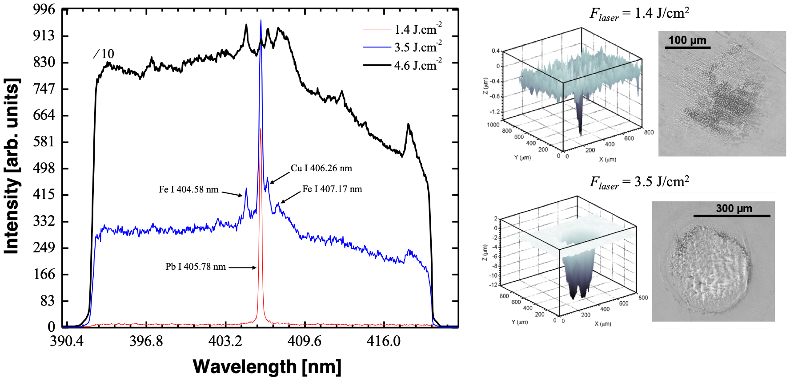{.fh-400}

::: {.takeaway .fragment}
At **1.4 J/cm²** the Pb I 405.78 nm line stands alone; at 3.5–4.6 J/cm² the continuum and Fe I / Cu I matrix lines rise, and OCT / SEM images show much larger craters.
:::

::: notes
- OCT (3D) and SEM views of the craters at 1.4 and 3.5 J/cm² — note the scale bars (100 µm vs 300 µm).
- The low-fluence regime is both analytically better and less destructive.
:::

## [Part 1b · LA-LIF]{.kicker} Two lasers: Nd:YAG ablation + OPO excitation

::: panel-tabset
### Spectral selectivity

:::: {.columns}
::: {.column width="60%"}
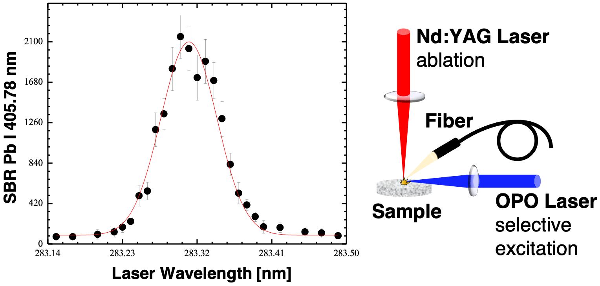{width="100%"}
:::
::: {.column width="38%" .side}
- The Nd:YAG pulse creates the vapor; the OPO, tuned to **283.31 nm**, excites Pb atoms in the plume.
- SBR exceeds **2000** on resonance.
:::
::::

### Ablation fluence × inter-pulse delay

:::: {.columns}
::: {.column width="55%"}
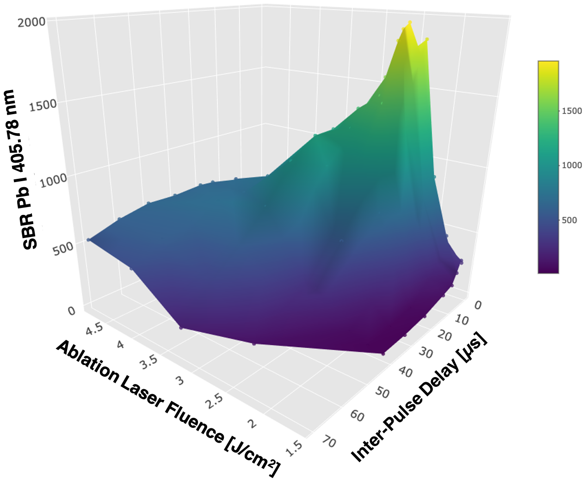{height="440px"}
:::
::: {.column width="43%" .side}
- The SBR surface peaks (≈ 2000) at the **lowest ablation fluences** and **short inter-pulse delays** (a few µs).
- Again: gentle ablation favors the LIF signal.
:::
::::

### Saturation

:::: {.columns}
::: {.column width="55%"}
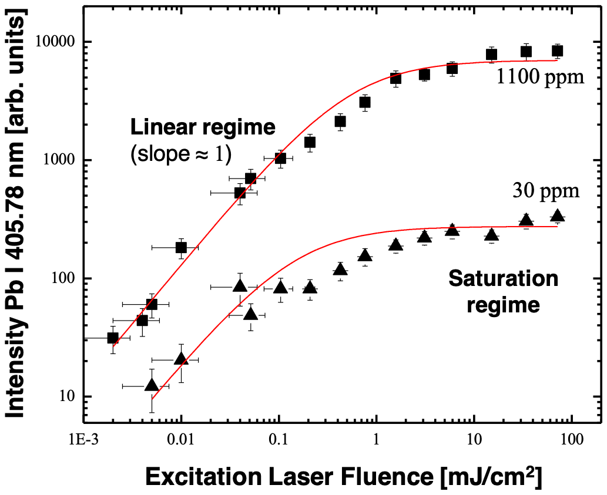{height="440px"}
:::
::: {.column width="43%" .side}
- **Linear regime**: fluorescence grows linearly (slope ≈ 1) with excitation fluence.
- **Saturation regime**: above ≈ 1 mJ/cm² the Pb ground-state population is depleted, for both 30 ppm and 1100 ppm samples.
- Only µJ-level excitation energies are needed.
:::
::::
:::

::: notes
- The 3D map summarizes a two-parameter optimization; maximum where ablation is gentle.
- Saturation is reached at very low excitation fluence (mJ/cm²): operating at saturation makes the signal insensitive to excitation-energy fluctuations.
:::

## [Part 1b · RLA-LIF & LA-LIF]{.kicker} Calibration: lead in copper alloys

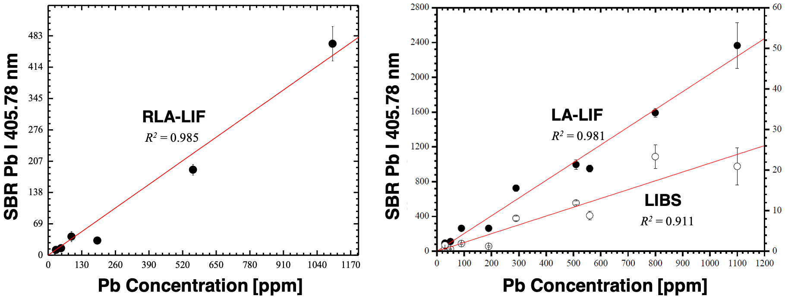{.fh-400}

:::: {.columns .side}
::: {.column width="33%"}
**LIBS**: DL **200 ppm** (R² = 0.911)
:::
::: {.column width="33%"}
**RLA-LIF**: DL **8 ppm** at only 1.4 J/cm² (R² = 0.985)
:::
::: {.column width="33%"}
**LA-LIF**: DL **200 ppb** (R² = 0.981)
:::
::::

::: notes
- Same samples, three methods. Left: RLA-LIF; right: LA-LIF (filled) vs LIBS (open).
:::

## [Part 1b · Results]{.kicker} Selective excitation lowers the Pb detection limit up to 1000×



:::: {.columns .side}
::: {.column width="50%" .fragment}
**LA-LIF**: the best (lowest) detection limit, three orders of magnitude below standard LIBS.
:::
::: {.column width="50%" .fragment}
**RLA-LIF**: 25× lower than LIBS at a much lower fluence, with **no additional laser**: simpler and cheaper.
:::
::::

::: notes
- The trade-off: LA-LIF gives the ultimate sensitivity but needs two synchronized lasers; RLA-LIF gives an order of magnitude-plus with a single laser.
:::

<!-- =====================================================================
     PART 2 · GROUNDWATER MONITORING
     ===================================================================== -->

# [Part 02]{.sec-num} Groundwater Monitoring {.section-divider .center background-color="#0b2545"}

::: sec-big
02
:::

::: sec-rule
:::

::: sec-question
Can LIBS quantify dissolved metals in CO₂-saturated brine at up to 400 bar?
:::

## [Part 2 · Groundwater monitoring]{.kicker} Why monitor groundwater above CO₂ storage sites?

```{=html}
<div class="flow">
  <div class="step fragment fade-up"><b>CO<sub>2</sub> leakage</b>from a geologic storage reservoir into overlying aquifers</div>
  <div class="arrow fragment fade-up">➜</div>
  <div class="step fragment fade-up"><b>Acidification</b>dissolved CO<sub>2</sub> lowers groundwater pH</div>
  <div class="arrow fragment fade-up">➜</div>
  <div class="step fragment fade-up"><b>Metal release</b>mineral dissolution mobilizes Ca, Mg, Sr, Ba, Mn…</div>
  <div class="arrow fragment fade-up">➜</div>
  <div class="step final fragment fade-up"><b>Down-hole LIBS</b>real-time, in-situ readout of water composition</div>
</div>
```

:::: {.columns style="margin-top:1.2em"}
::: {.column width="50%" .side}
[Overview]{.kicker}

An optical sensor based on **underwater LIBS**, designed for down-hole deployment, to track changes in subsurface water composition caused by CO₂ intrusion.
:::
::: {.column width="48%" .side}
[Goal]{.kicker}

- Quantify key elements (**Mg, Ca, K, Ba, Mn, Sr**) in brine.
- Under controlled high pressure: up to **400 bar (≈ 6,000 psi)** of CO₂ in carbonated brine.
:::
::::

::: notes
- The leak-detection logic: the water chemistry changes before CO₂ itself is easy to detect; metal concentrations are an early indicator.
- The analytical challenge: a plasma inside a liquid, at hundreds of bar, in high-salinity water.
:::

## [Part 2 · Groundwater monitoring]{.kicker} High-pressure underwater LIBS setup

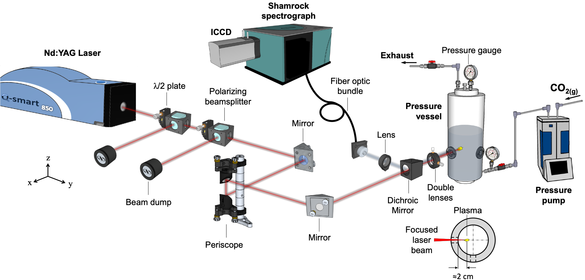{.fh-440}

[Nd:YAG pulses are focused inside a pressure vessel filled with the CO₂-saturated solution; plasma light goes through a fiber-optic bundle to a Shamrock spectrograph with ICCD; a pressure pump sets the CO₂ pressure.]{.caption}

::: notes
- Plasma generated directly in the bulk liquid, with collection through a dichroic mirror and fiber bundle.
- Related NETL work: design of a rugged, all-fiber-coupled LIBS sensor for down-hole use.
:::

## [Part 2 · Groundwater monitoring]{.kicker} Clean, well-resolved emission at 400 bar CO₂

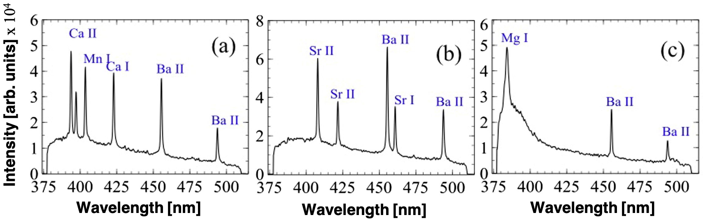{.fh-400}

[Underwater LIBS spectra at 400 bar CO₂ of (a) CaCl₂–MnCl₂–BaCl₂, (b) SrCl₂–BaCl₂ and (c) MgCl₂–BaCl₂ aqueous solutions.]{.caption}

::: notes
- Ionic and atomic lines of all target metals are resolved even at 400 bar.
- Ba serves as a common element across the three solutions.
:::

## [Part 2 · Groundwater monitoring]{.kicker} Acquisition settings hold from 10 to 400 bar

:::: {.columns}
::: {.column width="48%"}
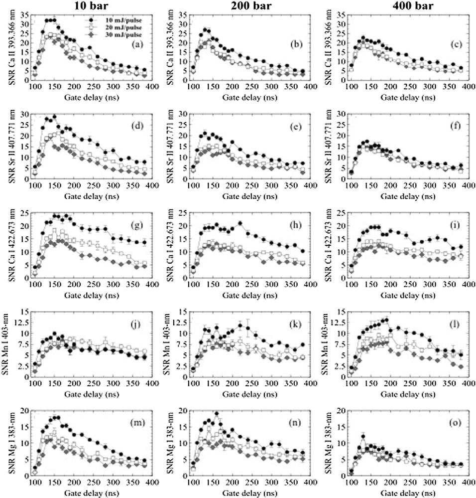{height="540px"}
:::
::: {.column width="50%"}
- SNR vs gate delay for **Ca II 393.37, Sr II 407.77, Ca I 422.67, Mn I 403** and **Mg I 383 nm** at 10, 200 and 400 bar, for 10, 20 and 30 mJ/pulse.

::: fragment
- SNR peaks at a gate delay of **≈ 130–170 ns** at every pressure.
:::

::: fragment
- The **lowest pulse energy (10 mJ)** gives the best SNR in most cases.
:::

::: {.fragment .takeaway}
Similar optimal settings across the full pressure range.
:::
:::
::::

::: notes
- Columns: 10, 200, 400 bar; rows: emission lines. Filled circles = 10 mJ.
- Practical point for a field sensor: no re-optimization as pressure changes.
:::

## [Part 2 · Groundwater monitoring]{.kicker} Linear calibration at every pressure

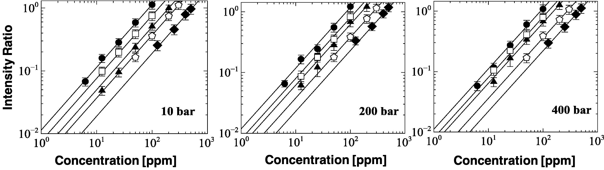{.fh-400}

[Calibration curves at 10, 200 and 400 bar for Ca (●), Sr (□), Mn (▲), Ba (⬠) and Mg (◆); R² ≥ 0.995 for all elements and pressures.]{.caption}

::: notes
- Log–log plots over roughly two decades of concentration; slopes are essentially unchanged with pressure (see table on next slide).
:::

## [Part 2 · Results]{.kicker} CO₂ pressure barely moves the detection limits

::: panel-tabset
### Chart



::: {.takeaway style="margin-top:.2em"}
From 10 to 400 bar, LODs for **Ca, Sr, Ba and Mg** stay within **≤ 1 ppm**; **Mn** even improves (10.5 → 5.2 ppm).
:::

### Table

```{=html}
<table class="data">
  <thead><tr><th>Metal</th><th>CO₂ (bar)</th><th>Slope S</th><th>R²</th><th>LOD (ppm)</th><th>LOQ (ppm)</th></tr></thead>
  <tbody>
    <tr><td>Mg</td><td>10</td><td>0.0019 ± 0.00003</td><td>0.9993</td><td>31.7 ± 0.9</td><td>105 ± 1</td></tr>
    <tr><td></td><td>200</td><td>0.0023 ± 0.00004</td><td>0.9996</td><td>31.1 ± 0.8</td><td>103 ± 3</td></tr>
    <tr><td></td><td>400</td><td>0.0022 ± 0.00002</td><td>0.9998</td><td>30.8 ± 1.1</td><td>102 ± 4</td></tr>
    <tr><td>Ca</td><td>10</td><td>0.0114 ± 0.0001</td><td>0.9996</td><td>2.5 ± 0.7</td><td>8</td></tr>
    <tr><td></td><td>200</td><td>0.0118 ± 0.0004</td><td>0.9958</td><td>2.5 ± 0.6</td><td>8</td></tr>
    <tr><td></td><td>400</td><td>0.0111 ± 0.0003</td><td>0.9980</td><td>2.7 ± 0.3</td><td>9 ± 1</td></tr>
    <tr><td>Sr</td><td>10</td><td>0.0076 ± 0.00007</td><td>0.9998</td><td>3.3 ± 0.1</td><td>11 ± 1</td></tr>
    <tr><td></td><td>200</td><td>0.0080 ± 0.0003</td><td>0.9956</td><td>3.0 ± 0.1</td><td>10 ± 1</td></tr>
    <tr><td></td><td>400</td><td>0.0080 ± 0.0001</td><td>0.9991</td><td>3.4 ± 0.3</td><td>11 ± 1</td></tr>
    <tr><td>Ba</td><td>10</td><td>0.0037 ± 0.00004</td><td>0.9997</td><td>4.4 ± 0.2</td><td>14 ± 2</td></tr>
    <tr><td></td><td>200</td><td>0.0038 ± 0.00002</td><td>0.9998</td><td>4.9 ± 0.1</td><td>16 ± 1</td></tr>
    <tr><td></td><td>400</td><td>0.0036 ± 0.00005</td><td>0.9994</td><td>3.9 ± 0.5</td><td>13 ± 3</td></tr>
    <tr><td>Mn</td><td>10</td><td>0.0050 ± 0.00008</td><td>0.9989</td><td>10.5 ± 0.1</td><td>35 ± 1</td></tr>
    <tr><td></td><td>200</td><td>0.0062 ± 0.0002</td><td>0.9968</td><td>7.4 ± 0.1</td><td>25 ± 1</td></tr>
    <tr><td></td><td>400</td><td>0.0064 ± 0.0001</td><td>0.9989</td><td>5.2 ± 0.1</td><td>17 ± 1</td></tr>
  </tbody>
</table>
```
:::

::: notes
- Each row = one metal; the three dots are 10, 200 and 400 bar. Tight clusters = pressure-independent performance.
- Mg has the highest LOD of the set (~31 ppm), but it is just as stable with pressure.
- Key message: underwater LIBS is viable for quantitative monitoring at reservoir-relevant pressures.
:::

<!-- =====================================================================
     PART 3 · SOIL TEXTURE
     ===================================================================== -->

# [Part 03]{.sec-num} Estimating Soil Texture {.section-divider .center background-color="#0b2545"}

::: sec-big
03
:::

::: sec-rule
:::

::: sec-question
Can LIBS spectra, decoded by chemometrics, predict sand, silt and clay fractions directly?
:::

## [Part 3 · Soil texture]{.kicker} Why soil texture, and why LIBS?

:::: {.columns}
::: {.column width="50%"}
[Overview]{.kicker}

Soil texture is essential for agriculture, environmental monitoring and land management. It governs:

- water retention
- nutrient availability
- erosion potential and soil health

…and therefore land-use and crop-management decisions.
:::
::: {.column width="46%"}
::: fragment
[Goal]{.kicker}

- Explore **LIBS** as a fast, cost-effective method for soil texture analysis.
- Use **chemometrics and machine learning** to model the complex relationships between LIBS spectra and soil properties.
:::

::: {.fragment style="margin-top:1em"}
[Featured on the back cover of *J. Anal. At. Spectrom.* 34 (2019)]{.tag .accent}
:::
:::
::::

::: notes
- Texture = proportions of sand, silt and clay. It is a physical property; LIBS measures elemental composition. The question is whether the elemental fingerprint carries enough information to infer texture.
:::

## [Part 3 · Soil texture]{.kicker} A sample set spanning the texture triangle

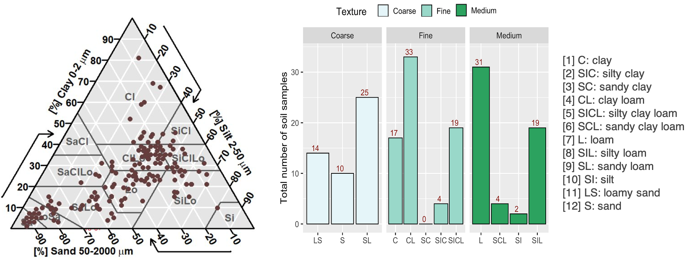{.fh-440}

[Samples in the USDA soil-texture triangle (left) and number of samples per textural class, grouped as coarse, medium and fine (right).]{.caption}

::: notes
- The model needs to see the whole texture space; most classes are represented, with loams and clay loams most frequent.
:::

## [Part 3 · Soil texture]{.kicker} Texture leaves an elemental fingerprint

:::: {.columns}
::: {.column width="58%"}
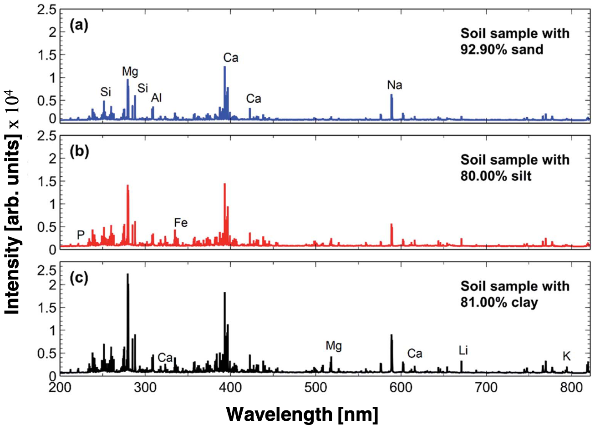{height="520px"}
:::
::: {.column width="40%"}
- Three end-members: **92.9% sand** (a), **80.0% silt** (b) and **81.0% clay** (c).

::: fragment
- Line intensities and ratios of **Si, Al, Fe, Mg, Ca, Na, K, Li, P** differ with texture.
:::

::: {.fragment .takeaway}
Texture is not measured directly; it is **inferred** from the full spectrum, so multivariate models are needed.
:::
:::
::::

::: notes
- Mineralogy differs between fractions: quartz-rich sands vs aluminosilicate clays, which carry more Al, Fe, K, Mg…
:::

## [Part 3 · Soil texture]{.kicker} Spectra cluster by texture before any regression

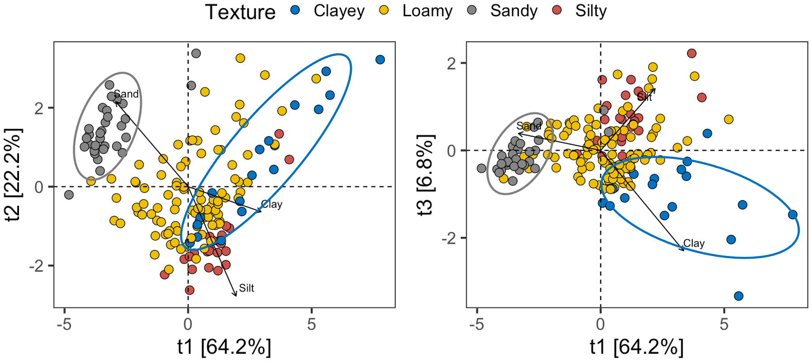{.fh-400}

::: {.takeaway .fragment}
PC1 (**64.2%** of variance) separates **sandy** from **clayey** soils, with loamy and silty soils in between: the spectra carry texture information.
:::

::: notes
- Unsupervised: PCA has no knowledge of texture labels, yet the classes organize along PC1.
:::

## [Part 3 · Machine learning]{.kicker} Two learners for a p ≫ n problem

```{=html}
<div class="fact-strip">
  <div><b>172</b>soils</div>
  <div><b>7,152</b>spectral variables</div>
  <div><b>51×</b>more variables than training samples</div>
  <div><b>3</b>targets: sand, silt, clay</div>
</div>
<div class="card-grid cols-2">
  <div class="card learner fragment fade-up">
    <div class="motto">Compress, then regress</div>
    <h3>Partial least squares regression (PLSR)</h3>
    <div class="eq"><i>w</i><sub><i>a</i></sub> = arg max<sub>‖<i>w</i>‖ = 1</sub> cov(<i>Xw</i>, <i>y</i>)<span class="op">&nbsp;&nbsp;then&nbsp;&nbsp;</span><i>ŷ</i> = <i>T q</i>,&nbsp; <i>T</i> = <i>XW</i></div>
    <ul>
      <li>Builds a few <b>latent variables</b> (LVs) that maximize covariance between spectra and target.</li>
      <li>Robust to collinearity and p ≫ n; LVs stay inspectable (loadings, VIP).</li>
      <li>Tuned: number of LVs (1–20).</li>
    </ul>
    <div class="picked"><b>Selected:</b> 4 · 6 · 3 LVs (sand · silt · clay), capturing 76 · 78 · 73 % of spectral variance.</div>
  </div>
  <div class="card learner fragment fade-up">
    <div class="motto">Shrink and select</div>
    <h3>Elastic net (penalized linear regression)</h3>
    <div class="eq"><i>β̂</i> = arg min<sub><i>β</i></sub> <sup>1</sup>&frasl;<sub>2<i>n</i></sub>‖<i>y</i> − <i>Xβ</i>‖₂² + <i>λ</i> [ <sup>1</sup>&frasl;<sub>2</sub>(1 − <i>α</i>)‖<i>β</i>‖₂² + <i>α</i>‖<i>β</i>‖₁ ]</div>
    <ul>
      <li><b>ℓ₁ (lasso)</b> term drives coefficients to zero: variable selection.</li>
      <li><b>ℓ₂ (ridge)</b> term shares weight across correlated wavelengths: stability.</li>
      <li>Tuned: mixing <i>α</i> × strength <i>λ</i> (6,000–8,000 grid points).</li>
    </ul>
    <div class="picked"><b>Selected:</b> α ≤ 0.01 (ridge-like), keeping 977 · 6,676 · 1,247 of 7,152 variables.</div>
  </div>
</div>
```

::: notes
- The problem: 7,152 highly collinear spectral variables, only 140 training soils. Ordinary least squares is impossible; we need either dimension reduction or regularization.
- PLSR compresses the spectra into a handful of latent variables chosen to predict the target (not just to explain spectral variance, as PCA would).
- Elastic net keeps the original wavelengths but penalizes the coefficients: α = 1 is the lasso (sparse), α = 0 is ridge (dense, grouped).
- Both were tuned with the same protocol (next slide). Interesting outcome: the elastic net chose α ≤ 0.01, i.e. almost ridge, so it did not end up sparse.
:::

## [Part 3 · Machine learning]{.kicker} Validation protocol: tune on training folds, judge on unseen soils

```{=html}
<div class="flow">
  <div class="step fragment fade-up"><b>Data</b>172 soils · averaged LIBS spectra (7,152 variables) · sand, silt, clay (%)</div>
  <div class="arrow fragment fade-up">➜</div>
  <div class="step fragment fade-up"><b>Hold-out split</b>140 training soils · 32 test soils locked away until the end</div>
  <div class="arrow fragment fade-up">➜</div>
  <div class="step fragment fade-up"><b>Tuning (training only)</b>autoscaling learned inside each fold · 10-fold CV × 5 repeats = 50 resamples · minimize RMSE</div>
  <div class="arrow fragment fade-up">➜</div>
  <div class="step final fragment fade-up"><b>Final evaluation</b>refit on all 140 soils · predict the 32 unseen soils once</div>
</div>
```

:::: {.columns style="margin-top:1.3em"}
::: {.column width="49%" .side .fragment}
[Target engineering]{.kicker}

Clay is modeled on a power scale, **clay<sup>0.54</sup>**, and predictions are back-transformed to % before scoring.
:::
::: {.column width="49%" .side .fragment}
[Figures of merit]{.kicker}

RMSE and MAE (% points), R², bias, and **RPIQ = IQR / RMSE**: scale-free, higher is better.
:::
::::

::: notes
- No information from the 32 test soils was used to choose preprocessing, model type or hyper-parameters.
- Centering/scaling is re-estimated inside each CV fold (caret), so the CV estimate is not optimistically biased by the preprocessing.
- RPIQ uses the interquartile range of the reference values, which is more robust than RPD for non-normal soil properties.
:::

## [Part 3 · Machine learning]{.kicker} Hyper-parameter tuning by repeated cross-validation

::: panel-tabset
### PLSR: number of latent variables



[Mean CV RMSE over 50 resamples (band: ±1 standard error). The error drops over the first 3–4 LVs and then flattens: compact models are enough.]{.caption}

### Elastic net: α × λ surface



[CV RMSE (mean of 50 resamples) for every (α, λ) pair, capped at 1.6 × the optimum. Sand and silt show a broad, flat valley at small, ridge-like α (16 % and 57 % of the grid within 1 SE of the optimum); clay has a sharper minimum at small α and weak penalty.]{.caption}
:::

::: notes
- Selection rule: lowest mean CV RMSE ("best"). A one-standard-error rule would pick even fewer LVs for sand and silt, with almost no loss.
- Elastic net grid: 8 α values × 1,000 λ values for sand and silt (12 × 500 for clay). The 3D surface is interactive: drag to rotate, use the buttons to switch fraction, hover for values.
- The elastic-net surface is very flat: for silt every α gives 8.81–8.94 % CV RMSE, and for α = 10⁻⁴ the error does not change with λ at all, so the selected (α, λ) is effectively a tie.
- Practical reading: there is no sparse subset of a few lines that beats a dense, ridge-like model.
- Flatness, measured as the share of the α × λ grid within one standard error of the best CV RMSE: sand 16 %, silt 57 %, clay 1 %. Clay is the only fraction where the penalty setting really matters.
:::

## [Part 3 · Machine learning]{.kicker} Independent test set: predicted vs. measured



::: {.takeaway .fragment}
On **32 unseen soils**, PLSR matches or beats the elastic net for all three fractions; sand is predicted best (R² 0.87), silt is the hardest (R² 0.73–0.79).
:::

::: notes
- Points close to the 1:1 line are good predictions; hover a point to see the sample ID.
- One sandy soil gets a slightly negative sand prediction (−2.5 %): unconstrained linear models do not know that fractions are bounded.
:::

## [Part 3 · Results]{.kicker} Performance summary

::: panel-tabset
### Metrics

```{=html}
<table class="data" style="font-size:.7em;margin-top:.2em">
  <thead>
    <tr class="group"><th colspan="2"></th><th>Cross-validation</th><th colspan="5" class="sep">Independent test set (n = 32)</th></tr>
    <tr><th>Fraction</th><th>Learner</th><th>R²</th><th class="sep">RMSE (%)</th><th>MAE (%)</th><th>R²</th><th>Bias (%)</th><th>RPIQ</th></tr>
  </thead>
  <tbody>
    <tr><td>Sand</td><td style="text-align:left">PLSR</td><td class="best">0.86</td><td class="sep best">11.12</td><td class="best">8.08</td><td class="best">0.87</td><td>−4.39</td><td class="best">4.02</td></tr>
    <tr class="emph"><td></td><td style="text-align:left">Elastic net</td><td>0.85</td><td class="sep">11.55</td><td>8.11</td><td>0.85</td><td class="best">−4.32</td><td>3.88</td></tr>
    <tr><td>Silt</td><td style="text-align:left">PLSR</td><td class="best">0.73</td><td class="sep best">9.18</td><td class="best">7.20</td><td class="best">0.79</td><td>+2.45</td><td class="best">2.90</td></tr>
    <tr class="emph"><td></td><td style="text-align:left">Elastic net</td><td>0.71</td><td class="sep">9.95</td><td>7.96</td><td>0.73</td><td class="best">+2.20</td><td>2.67</td></tr>
    <tr><td>Clay</td><td style="text-align:left">PLSR</td><td class="best">0.78</td><td class="sep best">5.98</td><td class="best">4.81</td><td class="best">0.80</td><td class="best">+1.49</td><td class="best">3.77</td></tr>
    <tr class="emph"><td></td><td style="text-align:left">Elastic net</td><td>0.76</td><td class="sep">6.77</td><td>5.30</td><td>0.73</td><td>+1.71</td><td>3.33</td></tr>
  </tbody>
</table>
```

::: {.caption style="text-align:center"}
CV: 10-fold × 5 repeats on the 140 training soils (clay R² on the clay<sup>0.54</sup> scale). Test: 32 held-out soils; clay back-transformed to %. Bold = better learner per fraction (bias: smaller magnitude).
:::

### CV resamples



[Each point is one of the 50 CV resamples (bar = mean). The two learners overlap almost entirely: mean differences (≈ 0.3 % for sand and silt) are small next to the resample-to-resample spread (SD ≈ 2 %).]{.caption}
:::

::: notes
- PLSR wins every accuracy metric on the test set; the elastic net only has a marginally smaller bias for sand and silt.
- The CV distributions overlap heavily, so the ranking is not a strong statistical statement: the honest conclusion is "equivalent accuracy, PLSR simpler".
- Systematic test bias (sand −4.4, silt +2.5 points) hints at a distribution shift between training and test soils.
:::

## [Part 3 · Machine learning]{.kicker} What drives the predictions? PLSR variable importance

::: panel-tabset
### Sand



### Silt



### Clay


:::

[VIP > 1 marks above-average contribution; about 30 % of the 7,152 variables exceed it (2,286 · 2,078 · 2,361 for sand · silt · clay). Wavelength axis reconstructed from 11 reference emission lines (RMS error 0.05 nm).]{.caption}

::: notes
- Importance is broad, not concentrated: consistent with the ridge-like elastic net.
- Recurrent contributors: Si I, Al I and Na I lines, and the broad Hα line at 656 nm; C I 247.9 nm stands out for silt; K I 766.5 nm and Fe I lines for clay.
- Physical reading (hypothesis): Si tracks quartz-rich sand, Al/K/Fe track aluminosilicate clay minerals; H may reflect moisture, hydroxyl groups or organic matter.
:::

## [Part 3 · Results]{.kicker} Take-home messages

```{=html}
<div class="stats cols-4 compact" style="margin-top:.4em">
  <div class="stat accent"><div class="stat-value">0.79–0.87</div>
    <div class="stat-label">test R² with PLSR</div><div class="stat-note">RPIQ 2.9–4.0 on 32 unseen soils</div></div>
  <div class="stat"><div class="stat-value">3–6</div>
    <div class="stat-label">latent variables are enough</div><div class="stat-note">PLSR ≥ elastic net on every fraction</div></div>
  <div class="stat"><div class="stat-value">α ≤ 0.01</div>
    <div class="stat-label">elastic net settles near ridge</div><div class="stat-note">signal spread over many emission lines</div></div>
  <div class="stat"><div class="stat-value"><span class="countup" data-to="99.6" data-decimals="1">99.6</span><small>%</small></div>
    <div class="stat-label">mean predicted sand + silt + clay</div><div class="stat-note">closure respected without any constraint</div></div>
</div>
```

::: {.takeaway .fragment style="margin-top:1.4em"}
Model choice matters less than the data: a **compact, interpretable PLSR** is the recommended learner for LIBS-based soil texture.
:::

::: notes
- Generalization was checked on soils never used for tuning.
- Parsimony: 3–6 LVs match an 8,000-model elastic-net search.
- Closure: the three independent models sum to 99.6 % on average (PLSR range 95.6–102.6 %).
- Natural next steps: compositional (log-ratio) targets to enforce closure and positivity, larger and stratified calibration sets to remove the test bias, and nonlinear learners once more data are available.
:::

<!-- =====================================================================
     WRAP-UP
     ===================================================================== -->

## [Wrap-up]{.kicker} Summary

```{=html}
<div class="card-grid cols-3" style="margin-top:.4em">
  <div class="card fragment fade-up">
    <div class="num">01 · SENSITIVITY</div>
    <h3>Wavelength-selective excitation</h3>
    <p><b>LA-LIF</b>: Pb DL 200 ppb, 1000× below LIBS.</p>
    <p><b>RLA-LIF</b>: 25× better with a single laser at 1.4 J/cm².</p>
    <p><b>RELIBS</b>: ≈ 5× better absolute DL (Mg) with ≈ 10× less ablated mass.</p>
  </div>
  <div class="card fragment fade-up">
    <div class="num">02 · HARSH ENVIRONMENTS</div>
    <h3>Underwater LIBS for groundwater</h3>
    <p>Quantitative Ca, Sr, Ba, Mn and Mg in CO<sub>2</sub>-saturated solutions up to <b>400 bar</b>.</p>
    <p>LODs of <b>2.5–32 ppm</b>, essentially independent of pressure; R² ≥ 0.995.</p>
  </div>
  <div class="card fragment fade-up">
    <div class="num">03 · COMPLEX MATRICES</div>
    <h3>Soil texture from LIBS</h3>
    <p>Sand, silt and clay predicted directly from LIBS spectra with PLSR and elastic net.</p>
    <p>Test R² of <b>0.79–0.87</b> and RPIQ 2.9–4.0 with PLSR on 32 unseen soils.</p>
  </div>
</div>
```

::: notes
- One sentence per thread; the common denominator is turning plasma physics into robust quantitative measurements.
:::

## [Wrap-up]{.kicker} Selected references

::: refs
S. Laville, **C.L. Goueguel**, H. Loudyi, F. Vidal, M. Chaker, M. Sabsabi. Laser-induced fluorescence detection of lead atoms in a laser-induced plasma: an experimental analytical optimization study. *Spectrochim. Acta Part B* **64**, 347–353 (2009). [doi:10.1016/j.sab.2009.03.021](https://doi.org/10.1016/j.sab.2009.03.021){.doi}

**C.L. Goueguel**, S. Laville, F. Vidal, M. Sabsabi, M. Chaker. Investigation of resonance-enhanced laser-induced breakdown spectroscopy for analysis of aluminium alloys. *J. Anal. At. Spectrom.* **25**, 635 (2010). [doi:10.1039/b927013b](https://doi.org/10.1039/b927013b){.doi}

**C.L. Goueguel**, S. Laville, F. Vidal, M. Chaker, M. Sabsabi. Resonant laser-induced breakdown spectroscopy for analysis of lead traces in copper alloys. *J. Anal. At. Spectrom.* **26**, 2452 (2011). [doi:10.1039/c1ja10112a](https://doi.org/10.1039/c1ja10112a){.doi}

**C.L. Goueguel**, C.R. Bhatt, J.C. Jain, C.L. Lopano, D.L. McIntyre. Quantification of dissolved metals in high-pressure CO₂–water solutions by underwater laser-induced breakdown spectroscopy. *Opt. Laser Technol.* **108**, 53–58 (2018). [doi:10.1016/j.optlastec.2018.06.048](https://doi.org/10.1016/j.optlastec.2018.06.048){.doi}

**C.L. Goueguel**, A. Soumare, C. Nault, J. Nault. Direct determination of soil texture using laser-induced breakdown spectroscopy and multivariate linear regressions. *J. Anal. At. Spectrom.* **34**, 1588–1596 (2019). [doi:10.1039/c9ja00090a](https://doi.org/10.1039/c9ja00090a){.doi}
:::

## Thank you {.hero .center background-color="#0b2545" background-gradient="radial-gradient(circle at 85% 10%, #1d4677 0%, #0b2545 48%, #071a33 100%)"}

::: hero-sub
Questions & discussion
:::



::: hero-author
Christian L. Goueguel, PhD
:::

::: hero-meta
[christian.goueguel@gmail.com](mailto:christian.goueguel@gmail.com) · ORCID [0000-0003-0521-3446](https://orcid.org/0000-0003-0521-3446)
:::
